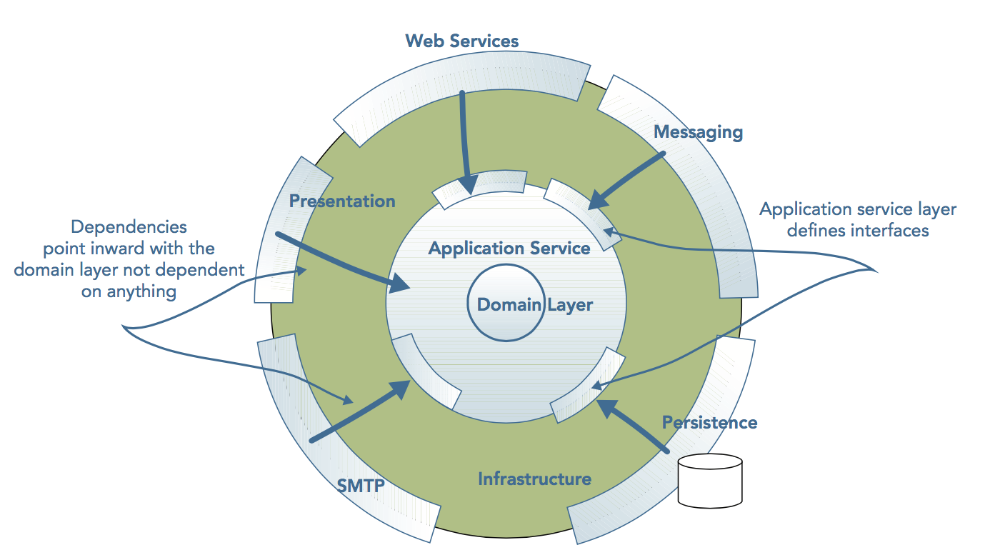

# How the application is layered ?

To support the separation of concerns in our project, we layer the different responsibilities of otchi,
as shown in the next figure. this architecture support the separation of 
concerns by dividing an application into 
areas 
that change together.
Unlike typical views of a layered architecture, the heart of this architecture is the domain layer containing 
all 
the logic pertaining to the business. Surrounding the domain layer is an application layer that abstracts the low-level
details of the domain behind a coarse-grained application programming interface (API) representing the business use cases 
of the application. The domain logic and application layers are isolated and protected from  the accidental complexities
of any clients, frameworks, and infrastructural concerns

## The Domain Layer

The Domain Layer is where the business is expressed. 
It represents a conceptual abstract view of the problem domain created to fulfill the needs of the business use cases.
The domain layer containing the abstract model does not depend on anything else and is agnostic to the technicalities of the clients it serves and data stores that persist the domain objects. 

## The Application Service Layer 

The application service layer represents the use cases and behavior of the application. Use cases are implemented as
application services that contain application logic to coordinate the fulfillment of a use case by delegating to the domain and
infrastructural layers. Application services operate at a higher level of abstraction than the domain objects, exposing 
a coarse-grained set of services while hiding the details of the domain layer—what the system does, but not how it does it.
By hiding the complexities of the domain behind a façade, you can evolve the domain model while ensuring that 
changes do not affect clients. 
The client of the domain layer is the application service layer; however, to perform its work, 
it requires dependencies on external layers.
These dependencies are inverted because the application layer exposes the contracts to the interfaces it requires.
The external resources must then adapt to the interfaces to ensure the application layer is not tightly coupled to 
a specific technology. 
Coordinating the retrieval of domain objects from a data store,
delegating work to them, and then saving the updated state is the responsibility of the application service layer. 
Application service layers are also responsible for coordinating notifications to other systems when significant events occur within the domain. 
All these interfaces with external resources are defined within the application service layer but are implemented in the infrastructural layer. 
The application service layer enables the support of disparate clients without compromising the domain layer’s integrity.
New clients must adapt to the input defined by the application’s contract— its API. They must also transform the output of the application service into a format that is suitable for them. In this way, the application layer can be thought of as an anticorruption layer, ensuring that the domain layer stays pure and unaffected by external technical details. 

## The Infrastructural Layers

The infrastructural layers of the application are the technical details that enable it to function.
Whereas the application and domain layers are focused on modeling behavior and business logic, respectively, 
the infrastructural layers are concerned with purely technical capabilities, such as enabling the application to be consumed,
whether by humans via a user interface or by applications via a set of web service or message endpoints.
The infrastructural layers are also responsible for the technical implementation of storing information on the state of domain objects. 
In addition, the infrastructural layer can provide capabilities for logging, security, notification. 
These are all external details— technical concerns that should not directly affect the use case exposed and the domain logic of an application. 
 